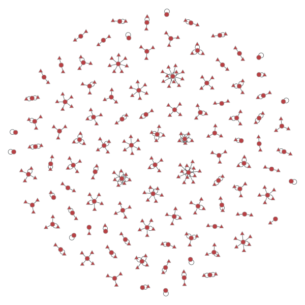
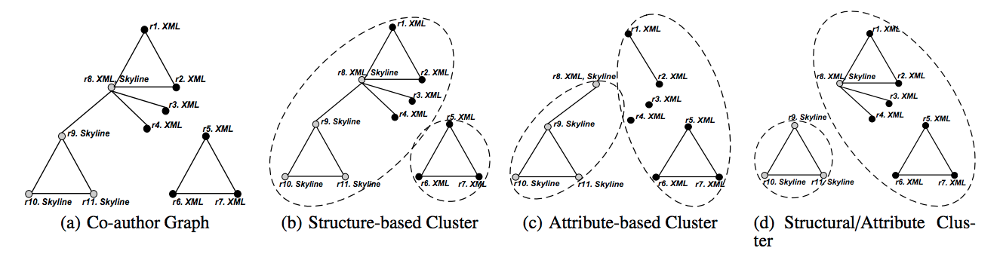

Analysis of Infocamere dataset though cluster/community discovering
===================
## Data collection
The collection contains data about organizations, i.e. id_code, type, financial value of the company, involved people and their roles.
As in the social network context, an interesting analysis could be considering organizations and people as graph node, and their relationships as edges and discovering how people and organizations are connected, who is their neighborhood and hidden relationships among them. 

For applying social network algorithms we have to convert the input dataset into a graph G(V, E), where V is the set of companies and people in the data collection and E their relationships. This is obtained in two steps:

 1. Data extraction:  for each document, the id_code of the company and
    the id_codes of all involved people/companies are extracted.
    Extracted people/companies could be related to the current company
    through different role types:
    *  anagrafica-titolare;
    * persona-fisica;
    * persona-giuridica;
    * soggetto-controllante.
    
    The output of this step is for each document the tuple (i, L), where i is the id_code of the current company and L = {(j, l_j)} is the set of companies/people (i.e. j ) involved with i and their relationship (i.e. l_j) (e.g. anagrafica-titolare, presona-fisica, etc.).
       
 2. Graph generation: given a company i and a list of relationships L = {(j, l_j)| j is the person/company, l_j is its role} extracted in Step 1, the graph G is obtained by adding to the node set V the set V' = {i, j_w| (j_w, l_w) \in L}  and to the edge set E the set E' = {(i, j_w, l_w)| (j_w, l_w) \in L}.

Finally, clustering algorithms based on graphs can be applied on G.

## Graph Visualization
The extracted graph could be easily visualized for identifying components (i.e. completely disconnected subgraphs) and explicit relationships among nodes. The idea is that the graph is very sparse, i.e. it has a low number of edges compared o the maximum number of possible edges. Graphs with a number of edges on the order of one, two or three times the number of nodes are often good for visualizing, and many different layout techniques will work well.

*Example of infocamere graph on a dataset of 100 documents. Triangular nodes are people, circular nodes are companies*

<!--[Graph clustering example2](images/infocamere_sample2.pdf)
*Example of betweenness centrality computation. Triangular nodes are people, circular nodes are companies*
-->

## Graph clustering
Graph Clustering techniques are widely used in detecting densely connected graphs from a graph network. The goal of graph clustering is to partition vertices in a graph into different clusters based on various criteria such as vertex connectivity or neighborhood similarity. 

Many existing graph clustering methods mainly focus on the topological structure of a graph so that each partition achieves a cohesive internal structure. Such methods include clustering based on **normalized cut**, **modularity**, **structural density**, etc. Others try to partition the graph according to attribute similarity, so that nodes with the same attribute values are grouped into one partition. 

A major difference between graph clustering and traditional relational
data clustering is that, graph clustering measures vertex closeness based on connectivity (e.g., the number of possible paths between two vertices) and structural similarity (e.g., the number of common neighbors of two vertices); while relational data clustering measures distance mainly based on attribute similarity (e.g., Euclidian distance between two attribute vectors).
In many real applications, both the graph topological structure
and the vertex properties are important. 

For example, in the case of Infocamere dataset, vertex properties describe the type of the company (e.g. Società a responsabilità limitata, società individuale, etc. ), the city where it is registered, the financial value, etc.; while the topological structure represents relationships among a group of
people/organizations.

An ideal graph clustering should generate clusters which have a cohesive
intra-cluster structure with homogeneous vertex properties, by balancing
the structural and attribute similarities.

In the following we show a clustering example of a co-author graph based on three different criteria (e.g. structure-based clustering, attribute-based clustering, structural/attribute clustering). In this graph a vertex represents an author and an edge represents the coauthor relationship between two authors. In addition, each node is characterized by an attribute which describe the vertex
property, i.e. . author's primary topic. 

Based on existing structural/attribute clustering algorithms, we enrich our input graph G with node' attributes information in the way to obtain a new and denser graph G'. 

